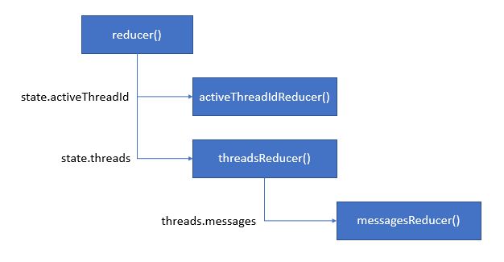

# Redux中间件

> create-react-app chat_intermediate  
> cd chat_intermediate  
> npm i --save-dev @reduxjs/toolkit react-redux  
> npm start  

以前的Redux版本，使用createStore创建store  
最新的官方版本，推荐使用@reduxjs/toolkit包下的configureStore方法  

注意store和reducer的分层结构(仿照Vue的Vuex结构，跟React项目模板redux的结构不太一致)  
src/store下的index.js是创建store的入口文件，App.js是唯一从store中读取数据的组件  
src/modules下的文件就是根据功能模块分类，创建相关的reducer函数  

- 使用@reduxjs/toolkit包下的configureStore方法，创建store  
- 将消息数据表示为处于state中的对象  

## 引入多线程

如果我们想要使应用程序，支持与不同的用户之间互通消息，需要引入多线程的概念  
每一组对话用户，拥有一个线程  
这就要改造消息数据结构，以支持不同的线程  

```javascript
//chatBox.js

    initialState:{
        activeThreadId:'1-fca2',
        threads:[{
            id:'1-fca2',
            title:'Buzz Aldrin',
            messages:[{
                id: nanoid(),
                text:'Twelve minutes to ignition',
                timestamp: new Date().toISOString()
            }]
        },{
            id:'2-be91',
            title:'Michael Collins',
            messages:[]
        }]
    },
```

新增的Thread.js函数组件，是用来替换MessageList.js组件的。它支持新的消息数据格式  
新增的ThreadTabs.js函数组件，用来切换不同的会话用户  

## 支持多线程的reducer

还需要更新reducer中的action处理逻辑，以支持新的消息数据格式  
需要说明的是，state中的threads对象，是新建的对象，包含原对象的所有属性，并附加了新的更改  
然后，代替state中的原来的对象。这样可以避免，在更新状态对象(state.threads)的时候，避免修改状态  

这里，使用了ES6中新增的对象扩展操作符(...)。它可以将一个对象或对象序列，完整复制(包括所有属性)到另一个对象中  
如果两个对象中，存在重复的元素，则根据先后顺序，最后的元素保留下来  
利用这个扩展操作符的特性，可以保持reducer函数的纯粹性  

## 拆分reducer函数

针对越来越复杂的应用，单一的reducer管理整个状态会越来越力不从心  
Redux有一种拆分状态管理逻辑的策略：reducer组合  

```javascript
//chatBox.js
    reducers:{
        OPEN_THREAD:(state, action)=>{state.activeThreadId = activeThreadIdReducer(state.activeThreadId, action);},
        ADD_MSG:(state, action)=>{state.threads = threadsReducer(state.threads, action);},
        DEL_MSG:(state, action)=>{state.threads = threadsReducer(state.threads, action);}
    }
}

function activeThreadId(state, action){
    if(action.type==='OPEN_THREAD'){
        return action.payload;
    } else {
        return state;
    }
}

function threads(state, action){
    if(action.type==='ADD_MSG'){
        ...
    } else if(action.type==='DEL_MSG'){
        ...
    }
}
```

从上面的代码可以看出，添加和删除消息的reducer仍有大量的重复代码  

消息的操作和线程间的切换属于不同的功能块，创建了不同的reducer负责具体的逻辑处理  
但是顶层的reducer()函数调用不变  
值得一提的是，新定义的reducer函数的接收参数：state、action。  
state参数，变成了现在的state.threads或state.activeThreadId。  
仍然保持state的参数名，是因为它可以清楚的表示出该参数是参数树的一部分，应该尽量避免在提取的reducer中意外修改它  
action参数，在唯一的子元素payload中，始终包含一个`type`属性(`chatBox/ADD_MSG`，`chatBox/DEL_MSG`，`chatBox/OPEN_THREAD`)。  
因为提取的reducer是在chatBox外部定义的，所以payload的`type`属性，会自动添加上前缀`chatBox/`  
另外，还可能传递其他的属性，如`action.payload.id`  

## 添加messageReducer()函数

下面是本示例应用中的所有reducer树的定义结构图  
  

我们新建messageReducer()函数，用来提取消息操作的重复代码  
使用switch语句来判断action.type，在单个reducer中处理复杂的action非常清晰明了  

## 在reducer中定义初始状态

可以给reducer中的声明函数，指定参数默认值  

## redux的combineReducers()函数

其实，是指@reduxjs/toolkit库中的combineReducers()函数  

当前示例中，未使用此函数。因为无法确定是否是编写错误，此函数不起作用  
