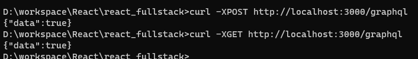
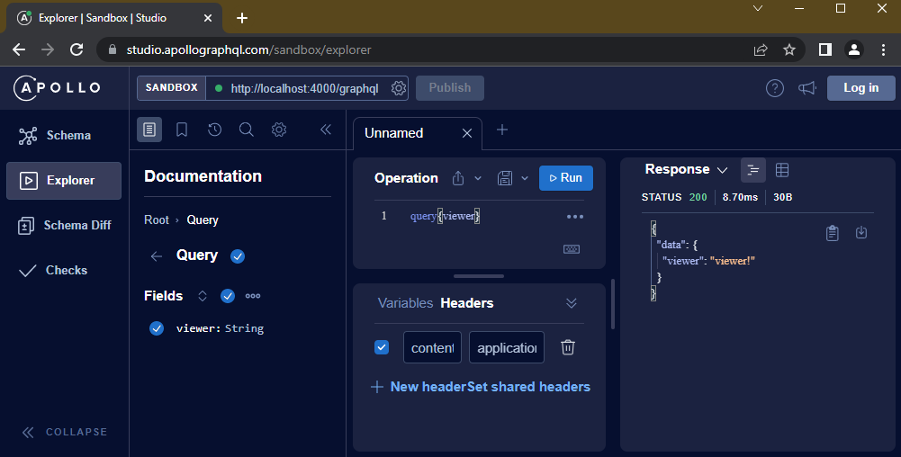
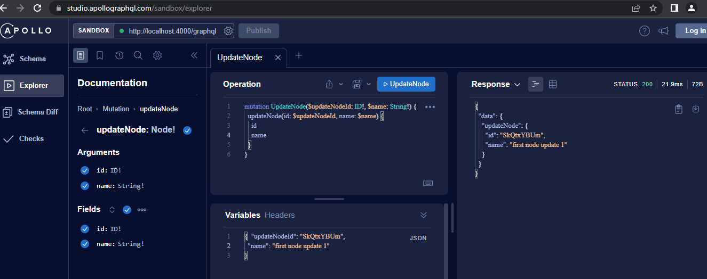
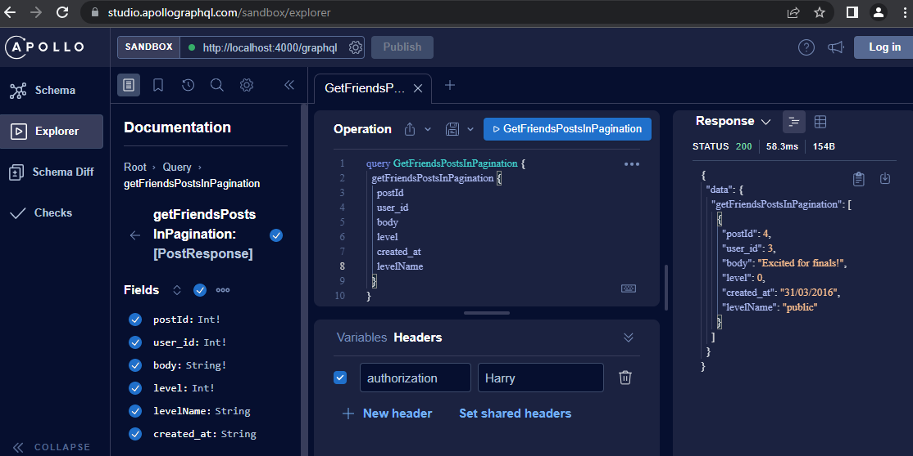

# GraphQL服务器

新版本的Node.js已经包含了Windows编译工具包，要通过它来支持sqlite  
还要Python安装，配置path环境变量  

> md graphql-server  
> cd graphql-server  
> npm init  
> npm i --save-dev @babel/core @babel/register babel-preset-env@next  
> npm i --save-dev express graphql  
> #npm i --save-dev express-graphql  
> npm i --save-dev apollo-server-express apollo-server-core  
> npm i --save-dev graphql-ws ws @graphql-tools/schema  
> #npm i --save-dev sqlite  
> npm i --save-dev sqlite3  
> npm i --save-dev sql.js  
> npm i --save-dev sequelize  
> echo {"presets":["env"]}>.babelrc  

@babel/core，@babel/register, babel-preset-env@next，这几个库，是为了方便`node index.js`命令的直接执行  

## Windows用户的特殊设置

### Express HTTP服务器

添加server.js  

```javascript
console.log({starting: true});
```

添加index.js  

```javascript
import * as babel_register from '@babel/register';
import './server.js';
```

然后，在当前目录下运行命令`node index.js`  
应收到如下输出：`{starting: true}`  

在server.js中，配置Express  

```javascript
console.log({starting: true});

import express from 'express';

const app = express();

app.use('/graphql', (req, res)=>{
    res.send({data:true});
});

app.listen(3000, ()=>{
    console.log({running:true});
});
```

在当前目录下运行命令`node index.js`  
应收到如下输出：`{starting: true} {running:true}`  
打开新的命令行，输入以下请求，检查服务器的响应  
  

> D:\React>curl -XPOST http://localhost:3000/graphql  
> {"data":true}  
> D:\React>curl -XGET http://localhost:3000/graphql  
> {"data":true}  

目前server.js的配置，未作GET/POST的区分  

### GraphQL服务器沙箱及curl请求

书中使用的`express-graphql`已过时，我们使用推荐的`apollo-server-express`代替  

关于Apollo Server的更多介绍，请查看[Introduction to Apollo Server](https://www.apollographql.com/docs/apollo-server/)  
关于Request的价绍，[How to send requests to Apollo Server over HTTP](https://www.apollographql.com/docs/apollo-server/requests)  

> node index.js  
> My GraphQL (apollo express) server is now running on http://localhost:4000/graphql  
> curl -X GET http://localhost:4000/graphql?query=query%7Bviewer%7D  
> curl http://localhost:4000/graphql?query=query%7Bviewer%7D  
> curl --get -d "query=query%7Bviewer%7D" http://localhost:4000/graphql  
> curl --get -d "query=query{viewer}" http://localhost:4000/graphql  
> {"data":{"viewer":"viewer!"}}  
> curl http://localhost:4000/graphql?query=%7B__schema%7BqueryType%7Bname%20fields%7Bname%20type%7Bname%7D%7D%7D%7D%7D  
> {"data":{"__schema":{"queryType":{"name":"Query","fields":[{"name":"viewer","type":{"name":"String"}}]}}}}  

```cmd
# 1. curl http://localhost:4000/graphql?query=query%7Bviewer%7D  

request: 
query{
  viewer
}

response: 
{
  "data": {
    "viewer": "viewer!"
  }
}

# 2. curl http://localhost:4000/graphql?query=%7B__schema%7BqueryType%7Bname%20fields%7Bname%20type%7Bname%7D%7D%7D%7D%7D  

request:
{
  __schema {
    queryType {
      name
      fields {
        name
        type {
          name
        }
      }
    }
  }
}

response:
{
  "data": {
    "__schema": {
      "queryType": {
        "name": "Query",
        "fields": [
          {
            "name": "viewer",
            "type": {
              "name": "String"
            }
          }
        ]
      }
    }
  }
}

```

"__schema"，"__type"，"__typename"是GraphQL的根操作中，自动存在的内省“元”字段  
其本质是服务器模式的JSON描述。这种内省规范的存在，是为了方便跨各种形式的GraphQL服务器的移植  

在浏览器中打开`http://localhost:4000/graphql`，然后访问沙箱服务，可以启动如下界面  

  

查询的请求类型是Query，变更的请求类型是Mutation  

准备好Mutation的schema后，GraphQL服务器重启  
在Sandbox上测试mutation的相关操作，一切正常  
  

> curl http://localhost:4000/graphql -XPOST -H "Content-Type:application/json" -d "{\"query\":\"mutation{addNode(id:\\""SkQtxYBUm\\"",name:\\""first-node\\""){id name}}\"}"  
> {"data":{"addNode":{"id":"SkQtxYBUm","name":"first-node"}}}  
> curl http://localhost:4000/graphql -XPOST -H "Content-Type:application/json" -d "{\"query\":\"mutation{addNode(id:\\""rklUl08IX\\"",name:\\""second-node\\""){id name}}\"}"  
> {"data":{"addNode":{"id":"rklUl08IX","name":"second-node"}}}  
> curl http://localhost:4000/graphql -XPOST -H "Content-Type:application/json" -d "{\"query\":\"mutation{updateNode(id:\\""SkQtxYBUm\\"",name:\\""first node update\\""){id name}}\"}"  
> {"data":{"updateNode":{"id":"SkQtxYBUm","name":"first node update"}}}  
> curl http://localhost:4000/graphql -XPOST -H "Content-Type:application/json" -d "{\"query\":\"query GetAllNodes {\n getAllNodes {\n id name\n}\n}\"}"  
> {"data":{"getAllNodes":[{"id":"SkQtxYBUm","name":"first node update"},{"id":"rklUl08IX","name":"second-node"}]}}  

```cmd
>>>Looping fakeDB...
Node { id: 'SkQtxYBUm', name: 'first node update' }
Node { id: 'rklUl08IX', name: 'second-node' }
>>>Results...
[
  Node { id: 'SkQtxYBUm', name: 'first node update' },
  Node { id: 'rklUl08IX', name: 'second-node' }
]
```

@2022-07-07
但是，<b style="color:red;">curl请求mutation的服务暂时没有成功</b>  
应该是参数设置的问题，标记此问题，待后补充  

> POST body missing, invalid Content-Type, or JSON object has no keys.  

@2022-07-08
上述问题已经解决。
原因：curl里的POST请求，设置的参数都是用单引号`'`包裹的  
修复：设置`"Content-Type:application/json"`，`-d`参数后的内容也必须用双引号`"`包裹起来  
需要注意的是，传递的json数据内容，如果包含双引号，要用`\"`转义  

### sqlite数据库设置

说明：  
本节是按照书中的方式，进行的操作  
我的改进步骤，可参考下面的`对象和标量类型`一节，以及对应代码  

首先，编写数据库的初始化脚本tables.js，包括数据库文件存储，表结构以及测试数据  
在该文件所在目录，执行命令`node tables.js`，得到如下输出，说明创建成功。  
检查目录下，应该生成了数据库文件graph-db.sqlite  

需要说明的是，测试数据的内容中可能包含单引号(')，在执行前，需要转义('')，防止插入失败  

> Create tables and init data...  
> Write database file to disk...  
> Done.  

执行命令`node database.js`，测试数据是否成功写入  

> columns:  [ 'id', 'name', 'about' ] ; rows:  5  
> columns:  [ 'user_id_a', 'user_id_b', 'level' ] ; rows:  12  
> columns:  [ 'id', 'user_id', 'body', 'level', 'created_at' ] ; rows:  4  

### 数据模型设计

GraphQL约定，从同一顶级node字段获取许多不同类型的对象  
所以，指定的顶级node的标识符ID必须是全局唯一的  
否则GraphQL服务器无法区分是哪个对象的ID  

```graphql
{
  node(id:"123"){
    ...on User{
      friends{
        # 好友列表
      }
    }

    ...on Post{
      author{
        posts{
          # 链接字段
        }
      }

      body
    }
  }
}
```

### 对象和标量类型

书中使用的node-sql已不再维护，我这里使用了另一款社区推崇的ORM库：sequelize  
[Sequelize Docs](https://sequelize.org/docs/v6/getting-started/)  
[Sequelize Docs 中文版](https://github.com/demopark/sequelize-docs-Zh-CN)  

Sequelize支持市面上流行的大多数数据库  
支持sqlite3，但是更高的sqlite版本，暂时未支持  

tables.js: 定义数据库对象的模型结构  
database.js: 向数据库表中插入初始化数据  
database-test.js: 测试数据是否插入成功  
其中，各表的`level`字段，原书设置的字段类型时`TEXT`，我这里改为了`Int`  
这是为了后期查询逻辑的简化(如：`getFriendsPostsInPagination()`)  

Paranoid - 偏执表  
定义模型的时候，如果设置了`paranoid:true`，则sequenlize创建表的时候，会自动添加`deletedAt`字段，以支持软删除  
其他会自动添加的字段包括：`id`，`createdAt`，`updatedAt`等  
需要注意的是，设置`timestamps: false`，会阻止自动添加的日期字段  

如果未启用偏执表属性，则无法使用该库自带的软删除；`destroy()`的结果都是硬删除，返回删除条数  
当然，在启用了偏执表属性时，也可以通过设置`destroy({force:true})`达到应删除的目的  
(变通方案：添加`isDeleted`，借助`update`操作)  

> node index-init.js>./posts/db/db-init.log  
> node index-test.js>./posts/db/db-test.log  

成功执行完上述两条命令，可以在`./posts/db/`目录下查看对应的log日志  

如果在`tables.js`文件内，实例化Sequelize的时候，启用了`logging:(...msg)=>console.log(msg)`配置，则在执行命令的控制台中，会输出同样详细的日志  

```javascript
    import { User } from './tables.js';
    const userList = await User.findAll();
    //console.log(userList);
    if(userList){
        userList.map(u=>{
          console.log(u.toJSON());
          console.log(JSON.stringify(u.dataValues));
          console.log(u.dataValues.name);
        });
    }
```

### 列表

GraphQL请求Users列表  

> get all users name:  
> curl --get http://localhost:4000/graphql -d "query=query{getAllUsers{name}}"  
> {"data":{"getAllUsers":[{"user_id":1,"name":"Harry"},{"user_id":2,"name":"David"},{"user_id":3,"name":"Hannah"},{"user_id":4,"name":"Roger"},{"user_id":5,"name":"Katie"}]}}  
> get user's name:  
> curl --get http://localhost:4000/graphql -d "query=query{getUserById(userId:1){user_id%20name%20about}}"  
> {"data":{"getUserById":{"user_id":1,"name":"Harry","about":"Sport!"}}}  
> add one user:  
> curl http://localhost:4000/graphql -XPOST -H "Content-Type:application/json" -d "{\"query\":\"mutation{addUser(user_id:7,name:\\""(curl)YP--7\\"",about:\\""(curl)No coments!\\""){user_id name about}}\"}"  
> {"data":{"addUser":{"user_id":7,"name":"(curl)YP--7","about":"(curl)No coments!"}}}  
> update one user:  
> curl http://localhost:4000/graphql -XPOST -H "Content-Type:application/json" -d "{\"query\":\"mutation{updateUser(user_id:7,name:\\""(curl)YP--7\\"",about:\\""(curl)[Updated]No coments!\\""){user_id name about}}\"}"  
> {"data":{"updateUser":{"user_id":7,"name":"(curl)YP--7","about":"(curl)[Updated]No coments!"}}}  
> delete one user:  
> curl http://localhost:4000/graphql -XPOST -H "Content-Type:application/json" -d "{\"query\":\"mutation{deleteUser(user_id:7)}\"}"  
> {"data":{"deleteUser":"Record(s) hard-deleted: 1"}}  
> delete users:  
> curl http://localhost:4000/graphql -XPOST -H "Content-Type:application/json" -d "{\"query\":\"mutation{deleteUsers(ids:[6,7,8,9])}\"}"  
> {"data":{"deleteUsers":"Record(s) hard-deleted: 3"}}  

```javascript
  // 1.
  const userList = await User.findAll({
    where:{
      user_id:{
        [Op.in]:args.ids
      }
    }
  });

  // 2.   
  const userList = await User.findAll({
    where:{
      user_id: args.ids
    }
  });

  // 清空数据表
  await User.destroy({
    truncate: true
  });
  // 删除User数据表
  await User.drop();
  // 删除所有数据表
  await sequelize.drop();
```

## 连接

### 排序和分组

Sequelize提供了`order`和`group`参数，来与`ORDER BY`和`GROUP BY`一起使用，以实现排序和分组  

```javascript
    getFriendshipInOrder:async()=>{
        let friendships = [];
        const friendshipList = await Friendship.findAll({
            attributes:[
                'userId',
                'friendId',
                [sequelize.fn('UPPER', sequelize.col('level')), 'LVL']
            ],
            order:[
                ['userId'],
                ['friendId', 'DESC'],
                sequelize.fn('UPPER', sequelize.col('level')),
                [sequelize.fn('UPPER', sequelize.col('level')), 'DESC']
            ]
        });
        if(friendshipList){
            friendshipList.map(friend=>{
                if(friend.dataValues){
                    const f = friend.dataValues;
                    friendships.push({
                        userId:f.userId, 
                        friendId:f.friendId,
                        level:f.LVL}
                    );
                }
            });
        }
        return friendships;
    }
```

### 分页

Sequelize使用`limit`和`offset`参数可以进行限制/分页  
`offset`设置跳过的条数  
`limit`设置本次返回的条数  

```javascript
        getMyPostsInPagination:async(root, args, context, info)=>{
            let posts = [];
            const postList = await Post.findAll({
                where:{
                    user_id:context.user_id
                },
                order:[
                    ['created_at', 'DESC']
                ],
                limit:5,
                offset:0
            });
            if(postList){
                postList.map(post=>{
                    if(post.dataValues){
                        const p = post.dataValues;
                        posts.push({
                            postId:p.postId,
                            user_id:p.user_id,
                            body:p.body,
                            level:p.level,
                            created_at:new Date(p.created_at).toLocaleDateString()}
                        );
                    }
                });
            }
            return posts;
        }
```

### 身份验证

将客户端的token通过header传入，存进服务端的context中  
这里为了方便演示，将token设置为了user的name；实际项目中应该设置真实的token，且一般都是放入缓存  

```javascript
// querySchema.js
export async function getUser(token){
    const users = await sequelize.query('SELECT * FROM users WHERE name=:token',{
        replacements:{token:token},
        type:QueryTypes.SELECT
    });
    if(users && users.length>0){
        const user = users[0];
        return {userId:user.userId, name:user.name, about:user.about};
    }
    return null;
}

// server.js
    const server = new ApolloServer({
        schema,
        context:async ({req})=>{
            const token = req.headers.authorization||'';
            const user = await getUser(token);
            if(!user){
                throw new AuthenticationError('you must be logged in');
            }
            //console.log("context: ");
            //console.log(user);
            return user;
        },
        ...

// resolvers.js
        ,getUserById:async(root, args, context, info)=>{
            if(!context || context.userId!=1){
                return null;
            }

            const user = await User.findOne({
                where:{
                    userId:{
                        [Op.eq]:args.userId
                    }
                }
            });
            if(user){
                //console.log(user.toJSON());
                return {userId:user.userId, name:user.name, about:user.about};
            }
            return null;
        }

```

> curl --get http://localhost:4000/graphql -H "authorization:Harry-fake" -d "query=query{getUserById(userId:1){userId%20name%20about}}"  

得到未授权异常：  

```cmd
{"errors":[{"message":"Context creation failed: you must be logged in","extensions":{"code":"UNAUTHENTICATED","exception":{"stacktrace":["AuthenticationError: Context creation failed: you must be logged in","    at ApolloServer.context at ...
```

> curl --get http://localhost:4000/graphql -H "authorization:Harry" -d "query=query{getUserById(userId:1){userId%20name%20about}}"  

得到正常结果：  

```cmd
{"data":{"getUserById":{"userId":1,"name":"Harry","about":"Sport!"}}}
```

### 授权

根据数据库的设计，只有达到特定level的user，才能查看对应的post  

此处使用了sequelize的raw query功能  

```javascript
        getFriendsPostsInPagination:async(root, args, context, info)=>{
            let posts = [];
            //console.log(context.user_id);
            let query = `SELECT postId, user_id, body, level, created_at 
            FROM posts AS Post 
            WHERE ( 
                Post.deletedAt IS NULL 
                AND EXISTS( 
                        SELECT 1 FROM usersFriends AS Friendship 
                        WHERE Friendship.deletedAt IS NULL 
                        AND Friendship.friend_user_id=Post.user_id 
                        AND Friendship.level>=Post.level 
                        AND EXISTS( 
                                SELECT 1 FROM users AS User 
                                WHERE User.deletedAt IS NULL 
                                AND User.user_id=Friendship.user_id 
                                AND User.user_id=${context.user_id} 
                            ) 
                    ) 
            ) 
            LIMIT 1 
            OFFSET 0;`;

            const postList = await sequelize.query(query,{
                type:QueryTypes.SELECT
            });
            console.log(postList);

            if(postList){
                postList.map(p=>{
                    //console.log(p);
                    //console.log(p.created_at);
                    posts.push({
                        postId:p.postId,
                        user_id:p.user_id,
                        body:p.body,
                        level:p.level,
                        created_at:new Date(p.created_at).toLocaleDateString()
                    });
                });
            }
            return posts;
        }
```

请求的结果:  

  

### 丰富的变更操作

创建新的帖子post  
这里的`created_at`字段没有手动传入，但是数据库中已经是正确的时间  
这是因为，在通过sequelize定义`posts`的时候，同时定义了它的默认值  

```javascript
        addPost:async(root, args, context, info)=>{
            let result = {isError:false, message: `Success!`};
            const post = await Post.findOne({
                where:{
                    postId:args.postId,
                    deletedAt:{
                        [Op.is]:null
                    }
                }
            });
            if(post){
                result.isError=true;
                result.message=`[Fail]: Found existing post(${args.postId})`;
                return result;
            }

            const post_add = await Post.create({
                postId:args.postId,
                user_id:context.user_id,
                body:args.body,
                level:args.level
            });
            if(post_add){
                console.log(JSON.stringify(post_add));
                result.message=`[Success]: Add post(${args.postId})`;
                return result;
            }

            result.isError=true;
            result.message=`[Fail]: Not able to create post(postId:${args.postId}, user_id:${context.user_id}, body:${args.body}, level:${args.level})`;
            return result;    
        }
```

### Relay和GraphQL

书中推荐了Facebook官方的库`graphql-relay`  
它可以内部自动生成分页的参数，以及简化的节点类型  

### 性能：N+1个查询

模式稳定后，需要关注产品的性能  
不同产品，对性能的需求也不一样  
工程师需要衡量高性能代码成本、收益，及额外的复杂性风险  

以本章数据库为例：  

通过一个user_id，查询`uers`表，得到user信息；然后查询`usersFriends`表，获得相关的好友列表；甚至查询每个好友的N个数据库查询  
这就是典型的N+1查询问题  

大量的查询会消耗不必要的服务器资源  
现在，有相当多的Web框架或ORM框架可以很好的处理这种问题  

Facebook维护了一个DataLoader的库，可以自动批量的提取相似数据的对象  
它支持批处理操作，以及缓存  

不过，我这里使用的Apollo Graph + Sequelize来实现了以上功能  
针对特别复杂的数据处理，建议交给后端，甚至数据库去处理  
前端重点放在数据展示和维护上  

## 更多好用的库

[Prisma](https://www.prisma.io/)  

- Build data-driven JavaScript & TypeScript apps in less time  
- Simple Database Access in GraphQL servers  
