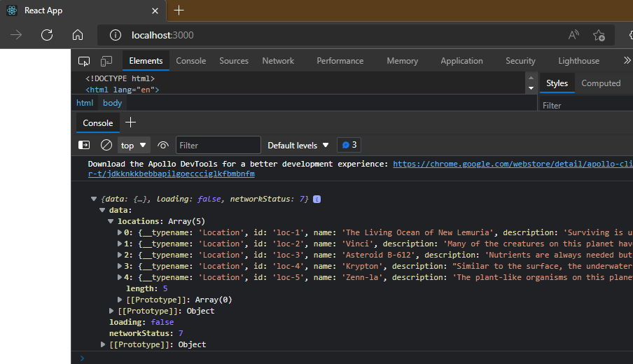

# 经典Relay

Relay是一个将React组件连接到API服务器的客户端JavaScript库，类似React和GraphQL的粘合剂  
书中介绍在客户端应用程序中，设置和使用Relay  

使用的数据库关系模型  

- authors表  
- books表  
- authorships表(包含authors表的author_id和books表的book_id)  

稍后，配置Apollo GraphQL Server的时候，会创建对应的模型  

现在，先学习Apollo Client的使用  
参照官方文档[Apollo Docs - Client(React)](https://www.apollographql.com/docs/react/get-started/)  

> create-react-app apollo-client-demo  
> cd apollo-client-demo  
> npm i --save-dev @apollo/client graphql  

@apollo/client库，实际上包含了安装Apollo客户端所需的一切  
它包括内存缓存、本地状态管理、错误处理和基于React的视图层  

graphql包则提供了解析GraphQL查询的逻辑  

通过执行命令`npm start`，测试Apollo Client是否请求成功  

```javascript
import * as babel_register from '@babel/register';
import { ApolloClient, InMemoryCache, ApolloProvider, gql } from '@apollo/client';
const client = new ApolloClient({
  /* url of GraphQL server */
  uri: 'https://flyby-gateway.herokuapp.com/', 
  /* an instance of InMemoryCache, 
  which ApolloClient uses to cache query results after fetching them */
  cache: new InMemoryCache(), 
});

/**
 * Test to send a query with plain javascript, 
*/
client.query({
  query:gql`
  query GetLocation{
    locations{
      id
      name
      description
      photo
    }
  }`
}).then((result)=>console.log(result));
```

可以在浏览器的开发者面板中看到返回的数据  
  

## 在React组件中调用GraphQL  

### Get started

首先定义一个组件DisplayLocations.js：定义gql的query结构，以及useQuery(query)的返回数据的呈现格式  
然后在App.js中引入上面定义的组件  
最后，在index.js中定义好ApolloClient的实例，并利用ApolloProvider，应用client到App组件及其子组件  

### Fetching

Queries

Dogs.js: query  
DogPhoto.js: cache/refresh/refetch  

Mutation

AddTodo.js: mutation  
Todos.js: update  

## BookStore

### 服务端开发  

> md bookstore-server  
> cd bookstore-server  
> npm init  
> npm i --save-dev @babel/core @babel/register babel-preset-env@next  
> npm i --save-dev express graphql  
> npm i --save-dev apollo-server-express apollo-server-core  
> npm i --save-dev graphql-ws ws @graphql-tools/schema  
> npm i --save-dev sqlite3  
> npm i --save-dev sequelize  
> echo {"presets":["env"]}>.babelrc  

书中没有此应用的服务端搭建过程的讲解  
我这里就自己搭建了一个本地服务端，详细过程请参考本章代码以及第14章的笔记内容  

> node index-init.js>./db/db-init.log  
> node index-test.js>./db/db-test.log  
> node index.js  

可以在浏览器中，打开服务端地址`http://localhost:4000/graphql`，测试query和mutation操作是否能正常工作  

### 客户端开发  

> create-react-app bookstore-client  
> cd bookstore-client  
> npm i --save-dev @apollo/client graphql  

书中使用的`react-dimensions`库，已经停止维护  
Github上建议的替代方案为`react-window`或`react-virtualized`  
两个库的作者是同一个人，对于轻量级的页面，建议使用`react-window`  

[react-virtualized](https://github.com/bvaughn/react-virtualized)  
[react-window](https://github.com/bvaughn/react-window)  
